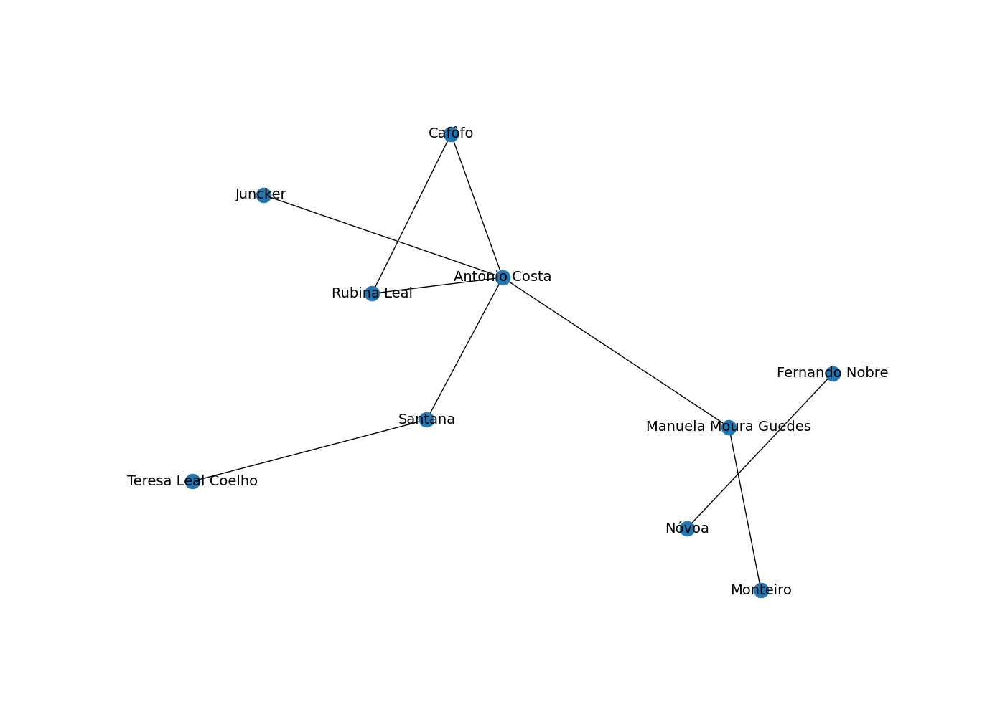

# NetworkX

NetworkX is a Python package that represents complex networks as graphs and allows for their manipulation.

Install the following libraries:

```bash
pip install pyjelly[rdflib] networkx==3.2.1 matplotlib==3.9.4
```

Below there are few useful examples to follow.

## Parse graph, show it

Let's investigate worldwide political connections (support and oposition relations)!
We are given a graph in `.jelly` containing information about political stances extracted from news articles.  
Let's dive in and get some useful information!

We can easily load it:  

```python
{!networkx_integration/01_parse_calculate_visualize.py! lines=16-19}
```  

Convert it into a convenient NetworkX graph:
```python
{!networkx_integration/01_parse_calculate_visualize.py! lines=21-22}
``` 

Is our graph fully connected? It's important to know (are all political relations tied togehter?), let's check here:
```python
{!networkx_integration/01_parse_calculate_visualize.py! lines=24-26}
``` 

Which nodes are connected the most (have most connections?), let's see top 5 of them:
```python
{!networkx_integration/01_parse_calculate_visualize.py! lines=28-32}
``` 

What is the shortest path between two nodes? We can check:
```python
{!networkx_integration/01_parse_calculate_visualize.py! lines=37-42}
``` 

However afterall, its best to the full picture (for our example we truncate to 15 nodes for clarity):
```python
{!networkx_integration/01_parse_calculate_visualize.py! lines=44-50}
``` 

The graph presents as follows  
.

In summary:

??? note "Full NetworkX integration example"
    {{ code_example('networkx_integration/01_parse_calculate_visualize.py') }}


we converted an RDFLib graph to NetworkX, calculated insightful metrics and visualized the graph.  

For more info about the data source please see:

-[Politiquices graph dataset](https://riverbench.github.io/v/2.1.0/datasets/politiquices/)

## Serialize NetworkX graph

This example shows how to write a NetworkX graph to a Jelly file.:

{{ code_example('networkx_integration/02_serialize.py') }}

which converts NetworkX graph into an RDFLib insance and serializes it.

## Related sources

To get more information, see the following:

- [NetworkX examples](https://networkx.org/documentation/stable/auto_examples/index.html)
- [NetworkX repository (github)](https://github.com/networkx/networkx)
- [RDFLib external graph integration](https://rdflib.readthedocs.io/en/7.1.0/_modules/rdflib/extras/external_graph_libs.html)
