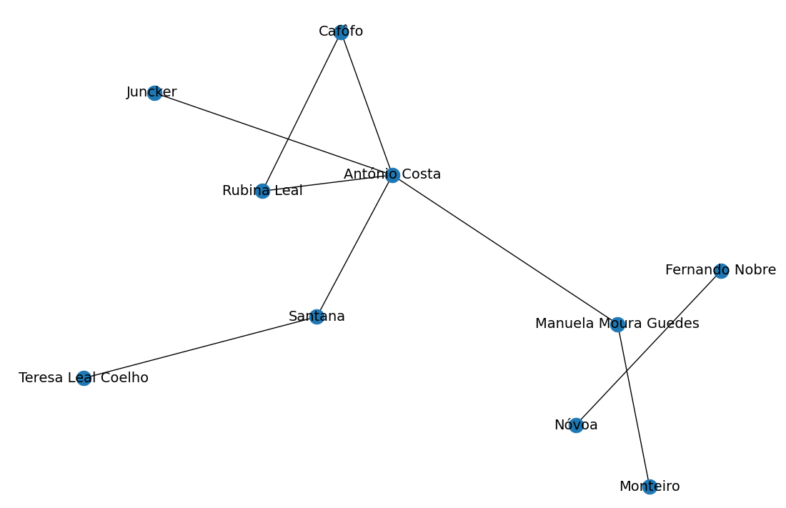

# NetworkX

NetworkX is a Python package that represents complex networks as graphs and allows for their manipulation.

Install the following libraries:

```bash
pip install pyjelly[rdflib] networkx==3.2.1 matplotlib==3.9.4
```

Below there are few useful examples to follow.

## Parse graph, show it

Let's say we have a graph in `.jelly` fromat and wanted some insight into it.  

We can easily load it:  

```python
{!networkx_integration/01_parse_calculate_visualize.py! lines=7-12}
```  

Convert it into a convenient NetworkX graph:
```python
{!networkx_integration/01_parse_calculate_visualize.py! lines=14-15}
``` 

Is our graph fully connected? It's important to know, let's check here:
```python
{!networkx_integration/01_parse_calculate_visualize.py! lines=17-18}
``` 

Which nodes are connected the most (the most congested?), let's see top 5 of them:
```python
{!networkx_integration/01_parse_calculate_visualize.py! lines=20-21}
``` 

What is the shortest path between two nodes we want to traverse? We can check:
```python
{!networkx_integration/01_parse_calculate_visualize.py! lines=24-25}
``` 

However afterall, its best to the full picture (for our example we truncate to 8 nodes for clarity):
```python
{!networkx_integration/01_parse_calculate_visualize.py! lines=27-43}
``` 

The graph presents as follows .

In summary:

{{ code_example('networkx_integration/01_parse_calculate_visualize.py') }}

we converted an RDFLib graph to NetworkX, calculated insightful metrics and visualized the graph.

## Serialize NetworkX graph

This example shows how to write a NetworkX graph to a Jelly file.:

{{ code_example('networkx_integration/02_serialize.py') }}

which converts NetworkX graph into an RDFLib insance and serializes it.

## Related sources

To get more information, see the following:

- [NetworkX examples](https://networkx.org/documentation/stable/auto_examples/index.html)
- [NetworkX repository (github)](https://github.com/networkx/networkx)
- [RDFLib external graph integration](https://rdflib.readthedocs.io/en/7.1.0/_modules/rdflib/extras/external_graph_libs.html)
